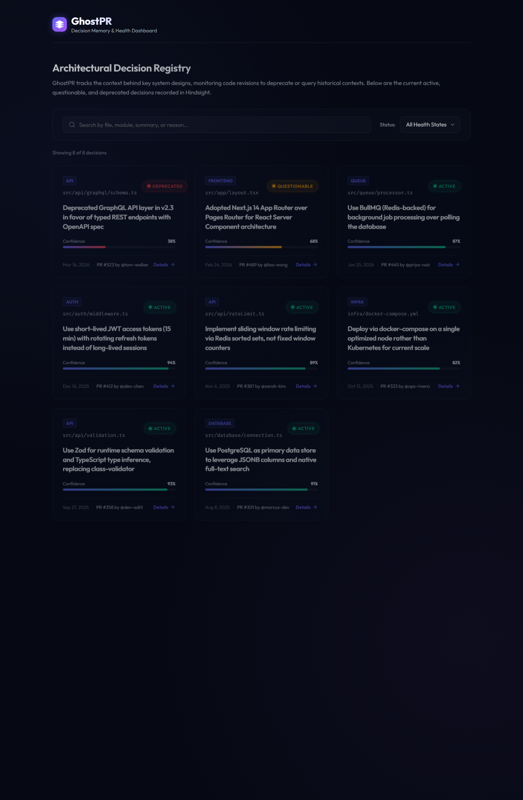
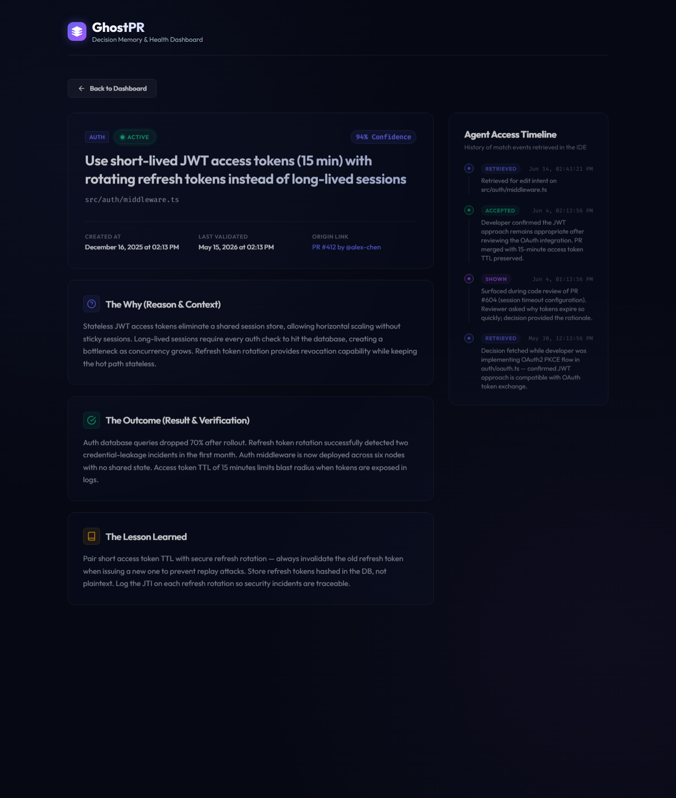
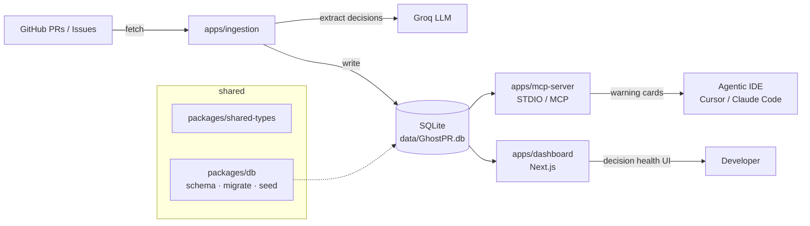

# GhostPR

### The Living Decision Memory for Agentic IDEs

GhostPR is a persistent, self-updating architectural decision registry designed specifically for Agentic IDEs (like Cursor, Claude Code, and Windsurf). It captures the **"why"** behind critical design decisions, workarounds, and tradeoffs, and automatically surfaces them as warning cards inside your AI assistant's context window before it touches the code.

By injecting this historical context, GhostPR prevents AI agents from accidentally refactoring crucial hacks, overriding platform-specific workarounds, or repeating past mistakes.

---

## 📸 Screenshots

**Decision Health Dashboard** — every architectural decision with its confidence, status, and source PR:



**Decision Detail** — the full "why / outcome / lesson" plus the agent retrieval timeline:



---

## 🚀 How it Works

1. **Automatic Ingestion:** GhostPR scans your GitHub Pull Requests and issues, using Groq LLM to extract key technical decisions (ignoring casual chat, typos, and simple bug fixes) and stores them in a local SQLite database.
2. **IDE Integration (MCP):** Using the Model Context Protocol (MCP), GhostPR integrates natively into your IDE. Before the AI makes an edit to any file in your workspace, it queries the GhostPR database.
3. **Pre-Edit Warnings:** If a file has decision history, the AI is presented with a context warning containing the Decision, Reason, Expected Outcome, and Lesson. The AI respects this context during edits.
4. **Time Decay & Verification:** Decisions decay over time (Active 🟢 -> Questionable 🟡 -> Deprecated 🔴). If subsequent PR diffs confirm or contradict the choice, the system revalidates or deprecates the record automatically.

---

## 🛠️ Setup Guide

### 1. Requirements
- **Node.js 24+**
- **pnpm** workspace manager
- **GitHub Personal Access Token** (with repository read permissions)
- **Groq API Key** (for decision extraction and signal scanning)

### 2. Installation
Clone the repository and install the dependencies:
```bash
git clone https://github.com/Gaurang774/GhostPR.git ghostpr
cd ghostpr
pnpm install
```

### 3. Environment Setup
Copy `.env.example` to `.env` and fill in your keys:
```bash
cp .env.example .env
```
Ensure the following variables are configured:
```ini
GITHUB_TOKEN=ghp_your_github_token
GITHUB_OWNER=your-org-or-username
GITHUB_REPO=your-repository-name
GROQ_API_KEY=gsk_your_groq_api_key
```

### 4. Database Initialization
Initialize your local SQLite database (schema only — your decisions come from your own repo via ingestion):
```bash
pnpm run migrate
```
This will create `data/GhostPR.db` (or whatever `DATABASE_PATH` you set in `.env`).

> **Trying it out?** Set `SEED_DEMO=true` in your `.env` before running migrate to load 8 sample decisions for a quick tour of the dashboard. Real installs leave this `false` so the database only ever contains decisions ingested from your repository.

### 5. Ingestion (Scan Repository History)
To read your repository's merged PRs and populate the decision memory:
```bash
pnpm run ingest
```

### 6. IDE MCP Configuration

First build the workspace (this creates `apps/mcp-server/dist/index.js`, which the MCP server runs):
```bash
pnpm run build
```

> **Prerequisite:** the MCP server only starts if **both** `apps/mcp-server/dist/index.js` (from `pnpm run build`) and `data/GhostPR.db` (from `pnpm run migrate`) exist. If the server shows as "failed" in your IDE, one of these is missing.

Then configure your IDE:

#### Claude Code / Claude Desktop
The repo already ships `.mcp.json` (uses `${CLAUDE_PROJECT_DIR}`). Claude Code auto-detects it when you open the project — run `/mcp` to (re)connect. For Claude Desktop, run `node scripts/mcp-setup.js` and paste the generated **Option A** block into `claude_desktop_config.json`.

#### VS Code (GitHub Copilot) / Cursor
The repo ships `.vscode/mcp.json` (uses `${workspaceFolder}`, so it works at any path — including paths with spaces). VS Code's native MCP support auto-detects it:

1. Open `.vscode/mcp.json` and click the **▶ Start** button above the `"GhostPR"` entry (or Command Palette → **MCP: List Servers** → GhostPR → Start).
2. Open Copilot Chat and switch the mode dropdown to **Agent**. **MCP tools only work in Agent mode** — not Ask or Edit mode.
3. Click the **🛠️ tools** icon in the chat box — `getFileDecisions`, `markDeprecated`, and `ignoreDecision` should appear.

> Note: `github.copilot.chat.mcpServers` in `settings.json` is **not** a valid setting — VS Code MCP servers are configured via `.vscode/mcp.json` only.

**Troubleshooting** (Command Palette → **MCP: List Servers** → GhostPR → **Show Output** for the server's stderr):
| Message | Fix |
| --- | --- |
| `❌ Database not found` | Run `pnpm run migrate` (set `SEED_DEMO=true` first for demo data) |
| `Cannot find module …dist/index.js` | Run `pnpm run build` |
| `node is not recognized` | Install Node.js 24+ and ensure it's on `PATH` |

---

## 🧪 Testing on Another Machine / Another Repo

GhostPR is repo-agnostic — each person who tries it uses **their own credentials** and points it at **whichever repository they want to analyze**. Two independent things to set up:

### A. Get it running on a fresh machine
1. **Install prerequisites:** Node.js 24+ (on `PATH`), `pnpm` (`npm install -g pnpm`), and Git.
2. **Clone, install, build:**
   ```bash
   git clone https://github.com/Gaurang774/GhostPR.git ghostpr
   cd ghostpr
   pnpm install
   pnpm run build
   ```
3. **Create a fresh `.env`** — never copy someone else's `.env` (it contains private keys):
   ```bash
   cp .env.example .env
   ```
   Keep `DATABASE_PATH=./data/GhostPR.db` (it's relative, so it works at any clone path).
4. **Quick no-credential demo:** set `SEED_DEMO=true` in `.env`, then:
   ```bash
   pnpm run migrate   # loads 8 sample decisions
   pnpm run dev       # dashboard at http://localhost:3000
   ```
   No GitHub or Groq keys are needed just to tour the dashboard with demo data.

### B. Point it at a different repository
Each tester fills `.env` with **their own** keys and the **target repo** they want to scan:
```ini
GITHUB_TOKEN=<the tester's own token>
GITHUB_OWNER=<owner of the repo to analyze>
GITHUB_REPO=<name of the repo to analyze>
GROQ_API_KEY=<the tester's own Groq key>
SEED_DEMO=false   # ingest real PRs instead of demo data
```

**Which GitHub token?** The pipeline only **reads** merged PRs — no write access needed. Generate it in *your own* GitHub account under **Settings → Developer settings**:

| Target repo | Classic PAT | Fine-grained PAT (recommended) |
| --- | --- | --- |
| **Public** | `public_repo` scope | scoped to that repo, **Pull requests: Read-only** |
| **Private** | full `repo` scope | scoped to that repo, **Pull requests: Read-only** (token owner must have repo access) |

Then ingest and run:
```bash
pnpm run migrate   # schema only when SEED_DEMO=false
pnpm run ingest    # scans the target repo's merged PRs
pnpm run dev
```

> **Security:** Each tester generates their own `GITHUB_TOKEN` and `GROQ_API_KEY` — never share or commit them. `.env` is git-ignored; keep it that way. The absolute `D:\...` paths in `.claude/skills` are specific to the original machine and don't apply elsewhere; use the `pnpm run …` commands above on other machines.

---

## 💻 Usage Guide

### Auto-Retrieval
You do not need to trigger anything manually. When you ask Cursor or Claude to edit a file that has history (like `auth/session.ts` or `payments/stripe.ts`), the AI assistant will query the database in the background, read the warning card, and adjust its implementation plan accordingly.

### AI Prompting Examples
You can query or modify the database manually through your AI assistant:
* **To check a file's history:**
  > *"Are there any active design decisions or workarounds I should be aware of before editing auth/session.ts?"*
* **To manually archive/deprecate a decision:**
  > *"We have switched to the standard OAuth flow. Please deprecate the custom HDFC bank OAuth workaround decision in auth/session.ts."*

### Background Execution
The MCP server is managed directly by your IDE. You **do not** need to keep a terminal open or run a command in the background for the AI to receive context warnings. As long as your IDE is open, the server runs automatically.

---

## 📊 The Next.js Dashboard
To browse your repository's decision health, track confidence decay, and inspect AI retrieval logs:
1. Start the local dev server:
   ```bash
   pnpm run dev
   ```
2. Open your browser to **[http://localhost:3000](http://localhost:3000)**.
3. The dashboard automatically monitors the database file on disk and reloads when new PRs are ingested or tools are run.

---

## 🏗️ Repository Architecture



| Path | Responsibility |
| --- | --- |
| `apps/ingestion` | CLI pipeline that fetches PRs, extracts decisions via Groq, and scores health. |
| `apps/mcp-server` | STDIO MCP server that surfaces decision context to the IDE. |
| `apps/dashboard` | Next.js dashboard for browsing decision health and retrieval logs. |
| `packages/db` | SQLite schema, migrations, and seed scripts (`SEED_DEMO` controls demo data). |
| `packages/shared-types` | Shared TypeScript definitions across all apps. |
